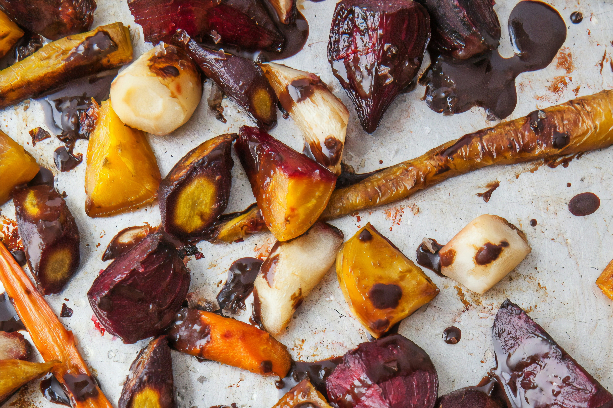

 # How to Roast Vegetables 

Roasted Vegetables are a favorite fall dish in many homes in the United States. It is a simple and delicious way to prepare many in-season root vegetables. Other vegetables, such as various squashes, can also be roasted.

## Possible Vegetable Choices
  > This is not an exhaustive list but merely contains some suggestions of vegetables that are easily accessible at farmers markets, supermarkets or your own backyard at this time of year. Be creative!
  
- Red, Golden or White Beets
- Carrots
- Parsnips
- Turnips
- Sweet Potatoes
- Yams
- Yellow Potatoes
- White Potatoes
- Onions
- Garlic
- Butternut Squash
- Acorn Squash

## Steps

1. Preheat the oven to 425&deg;F.

2. Prepare a sheet pan (optionally, you can also cover it with aluminum foil) by covering the surface with a thin layer of  olive or vegetable oil.

3. Dice all your vegetables.
    > The larger your cubes the longer they will take to cook. 

4. Toss vegetable cubes with oil and coarse salt. 

5. Spread the vegetables in a single layer on the prepared pan.
    > You will want squashes on a separate pan from the root vegetables as they cook faster.  

6. Place in the preheated oven and cook until you can easilly pierce the vegetables with a fork, about 1 hour.
    > Flip the vegetables about halfway through cooking.

 

